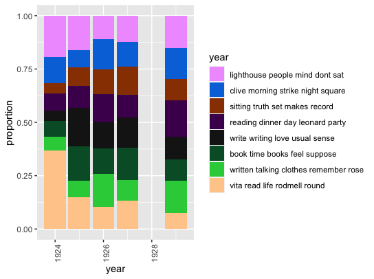
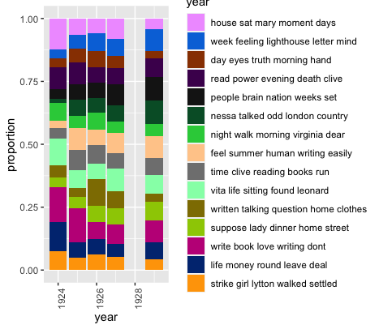
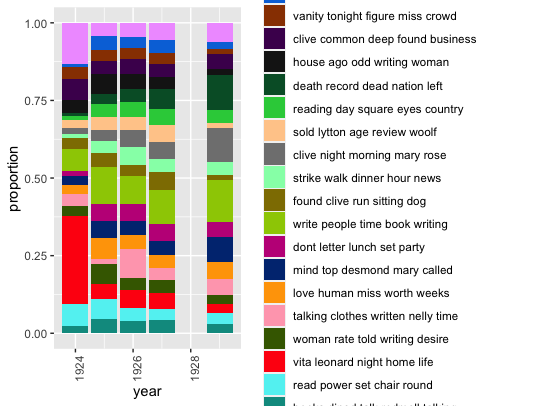
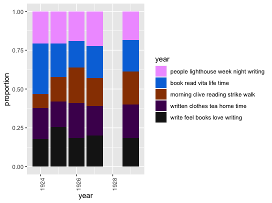

# [home](https://paula-rodrigo.github.io/woolfdiaries.github.io/)
---

After cleaning up my data and putting it into a csv file on Excel, I used Rstudio to create a topic model for the diary entries. I was especially interested in looking at the topics over time. In the visualizations below, you will see that Woolf did not write any diary entries in 1928. I am not entirely sure why, but it may be because she was working on another book, *Orlando: A Biography*, that year. By 1929, *To the Lighthouse* had been published and Woolf may have been reflecting back on it.

I experimented with different numbers of topics, starting from 15, then 20, then 5, then 8. I found that for the size of my corpus, 8 topics was the perfect amount to see a patern in the change of topics over time.

Here we can see that she writes less about the lighthouse and about Vita as time goes on but more about Leonard and home life. The topics of writing and books also gradually lessens over time. ...

---

Topics over time, 15 topics.

Topics over time, 20 topics.

Topics over time, 5 topics.

I found that 15 and 20 topics were too broad and cluttered to see any meaningful patterns while 5 topics was too narrow.

---
The code I used in R:

<object data="vw-tm.R" width="600" height="350"></object>

---
click [here](https://github.com/paula-rodrigo/week-six/tree/master/vw-diaries-r) for all of the data and scripts that I used.
